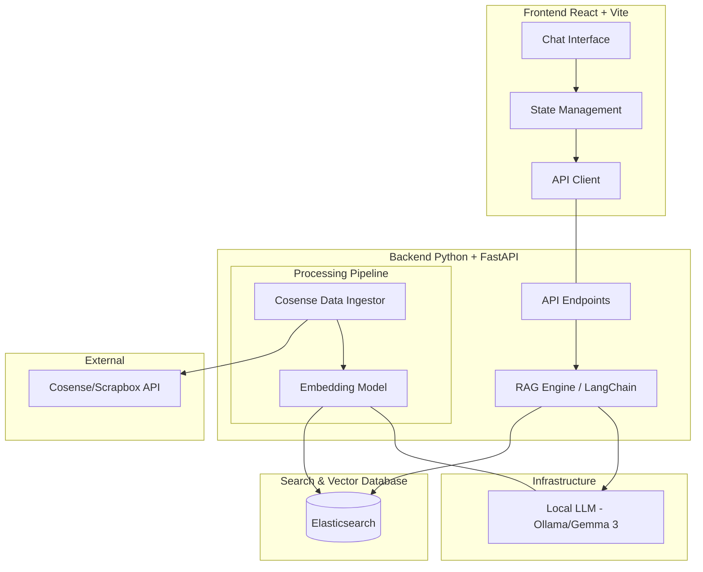

# System Architecture

This document describes the high-level architecture of the `rag-cosense` project.

## Overview

The system is a Retrieval-Augmented Generation (RAG) platform that integrates Cosense (Scrapbox) data with Large Language Models (LLMs).



## Component Details

### Frontend
- **React + Vite**: A modern single-page application (SPA).
- **Chat Interface**: The primary UI for user interaction.

### Backend
- **FastAPI**: Provides the REST API for the frontend.
- **LangChain**: Orchestrates the RAG workflow (Retrieval, Prompt Construction, LLM Interaction).
- **Ingestor**: Fetches pages from Cosense and processes them into chunks.

### Infrastructure / Tools
- **Elasticsearch**: A distributed search and analytics engine used for both full-text search and vector similarity search.
- **Ollama**: Local LLM runner providing the model (Gemma 3) for privacy-conscious inference.

### External Integrations
- **Cosense (Scrapbox)**: The source of truth for the knowledge base.

## Design Details (TBD)

### 1. Data Flow

#### Ingestion Flow (Async Syncing)
1. **Initiate**: Frontend calls `POST /api/index/sync`. Backend returns `task_id` (202 Accepted).
2. **Fetch**: A background task calls the Cosense API to retrieve page lists and metadata.
    - *Note*: Implement rate-limiting/throttling to respect Cosense API limits.
3. **Delta Check**: Compare `last_updated` from API with existing Elasticsearch docs to skip unchanged pages.
4. **Processing Pipeline**: 
    - **Clean**: Remove Scrapbox-specific formatting.
    - **Chunk**: Split via `RecursiveCharacterTextSplitter`.
    - **Embed**: Call **Ollama** API to generate 1024-dim vectors (Gemma 3).
5. **Persistence**: Upsert into **Elasticsearch** as hybrid documents (text + vector).
6. **Reporting**: Background task updates its status (`processing` -> `completed`). 
7. **Polling**: Frontend calls `GET /api/index/sync/{task_id}` intermittently to update progress UI.

#### Query Flow (RAG Pipeline)
1. **Submit**: Frontend calls `POST /api/chat` with user query and context window (chat history).
2. **Embed Query**: Backend calls **Ollama** to convert the user's question into a vector.
3. **Retrieval (Hybrid Search)**: 
    - **Keywords**: BM25 search for exact matches in the `text` field.
    - **Semantic**: k-NN search for similar vectors in the `vector` field.
    - **Rank Fusion**: Use **RRF** (Reciprocal Rank Fusion) via Elasticsearch to merge rankings.
4. **Context Building**: Extract Top-K (default=5) text chunks as context.
5. **Prompt Generation**: Construct a prompt containing Context + Chat History + Current Question.
6. **Inference**: Send prompt to **Ollama (Gemma 3)** for natural language generation.
7. **Complete**: Return the answer and source metadata to the frontend.

### 2. Backend API Specification

#### Common Response Format
Following `api-contract.instructions.md`, all responses wrap data or errors:
- **Success**: `{ "status": "success", "data": { ... } }`
- **Error**: `{ "status": "error", "message": string, "code": string }`
  - Codes: `AUTH_ERROR`, `SYNC_ALREADY_RUNNING`, `LLM_UNAVAILABLE`, `NOT_FOUND`.

#### Data Models (Pydantic/TypeScript)
- **`ChatMessage`**: `{ role: "user" | "assistant", content: string }`
- **`SourceReference`**: `{ title: string, url: string, score: number }`

#### Endpoints

##### 1. `POST /api/chat`
- **Purpose**: Interactive RAG chat.
- **Request Body**:
  ```json
  {
    "query": "string (min_length=1)",
    "chat_history": "Array<ChatMessage> (max_length=10)"
  }
  ```
- **Response Data**:
  ```json
  {
    "answer": "string",
    "sources": "Array<SourceReference>"
  }
  ```

##### 2. `POST /api/index/sync`
- **Purpose**: Start an asynchronous background task to sync Cosense pages.
- **Request Body**: `{ "projects": "string[]" }`
- **Behavior**: Uses FastAPI `BackgroundTasks`. 
    - *Future Note*: Consider persisting task state in a lightweight database (e.g., SQLite) for persistence across backend restarts.
- **Response Data**: `{ "task_id": "string", "status": "accepted" }`

##### 3. `GET /api/index/sync/{task_id}`
- **Purpose**: Poll the progress of a specific sync task.
- **Response Data**:
  ```json
  {
    "task_id": "string",
    "status": "processing | completed | failed",
    "progress": {
      "total_pages": "number",
      "synced_pages": "number",
      "errors": "string[]"
    }
  }
  ```

##### 4. `GET /api/status`
- **Purpose**: System health check.
- **Response Data**:
  ```json
  {
    "backend": "up",
    "elasticsearch": "connected",
    "ollama": "connected",
    "model_loaded": "gemma3"
  }
  ```

#### Frontend Integration Notes
- **Polling**: Frontend handles `POST /api/index/sync` by capturing the `task_id` and polling the status endpoint until `status === 'completed'`.
- **Error Handling**: Use the `code` field to trigger specific UI feedback (e.g., "Ollama is down" or "Authentication required").

### 3. Search & Retrieval Strategy
- **Indexing Strategy**:
    - **Field Mappings**:
        - `text`: `text` type (Full-text search enabled).
        - `vector`: `dense_vector` type (Dimensions depend on the embedding model, likely 1024 for Gemma 3 based embeddings).
        - `metadata`: `keyword` or `date` types for `source_url`, `page_title`, `project_name`, and `updated_at`.
    - **Chunking**: `RecursiveCharacterTextSplitter` with ~1000 chars and 15% overlap.
- **Retrieval Logic (Hybrid Search)**:
    - **Stage 1 (Search)**: Parallel execution of:
        - **BM25 Search**: Traditional keyword matching. Apply **Boosting** to `page_title` for higher relevance.
        - **KNN Vector Search**: Semantic similarity search using the query embedding.
    - **Stage 2 (Reranking)**:
        - Use **Reciprocal Rank Fusion (RRF)** to combine and rank results from both search methods.
    - **Stage 3 (Augmentation)**:
        - Top-K results (e.g., K=5) are passed to the Prompt Template as context.
- **Technology**: LangChain `ElasticsearchStore` integration.

### 4. Local LLM Configuration
- **Model Runner**: [Ollama](https://ollama.com/)
    - Backend reaches Ollama via internal Docker network: `http://ollama:11434`.
- **Model Selection**: **Gemma 3 (4b recommended for speed, 12b for quality)**.
    - **Inference**: High-quality natural language generation and instruction following.
    - **Embeddings**: Used to generate dense vectors for Elasticsearch indexing.
- **Initialization & Model Management**:
    - **Flow**:
        1. Start Ollama container.
        2. Automatic pull: A startup script or backend check executes `ollama pull gemma3`.
        3. Verification: Backend confirms model status via `GET /api/tags`.
- **System Prompt Design**:
    - "You are a helpful assistant. Use ONLY the provided context snippets to answer. If you don't know, say you don't know."
    - Strict Markdown output for compatibility with the Chat UI.

### 5. Frontend Architecture
- **State**: Chat history management.
- **Components**: UI modularization.

### 6. Deployment & Environment

#### Docker Compose Service Structure
All services run within a single `compose.yml` file using a dedicated bridge network (`rag-network`).

- **Service Communication**:
    - Services resolve each other by name (e.g., the backend accesses `http://elasticsearch:9200`).
    - *Tip*: Use `extra_hosts: ["host.docker.internal:host-gateway"]` to allow container-to-host communication across different OS environments.
- **GPU Acceleration**:
    - **NVIDIA GPU (Linux/Windows)**: Uses `nvidia-container-toolkit`.
      ```yaml
      services:
        ollama:
          deploy:
            resources:
              reservations:
                devices:
                  - driver: nvidia
                    count: 1
                    capabilities: [gpu]
      ```
    - **Apple Silicon (macOS)**: Run Ollama as a native macOS application for Metal acceleration. Backend connects via `host.docker.internal:11434`.

#### Data Persistence
- **Elasticsearch**: Data indices are persisted in a named volume `es_data` (`/usr/share/elasticsearch/data`).
- **Ollama**: Downloaded models are persisted in `ollama_data` (`/root/.ollama`).

#### Environment Management
Configuration is centralized in a `.env` file.

**Template (`.env.example`):**
```bash
# Backend
BACKEND_PORT=8000

# Cosense
COSENSE_COOKIE=connect.sid=... # Required for private projects

# Infrastructure
ELASTICSEARCH_URL=http://elasticsearch:9200
ES_JAVA_OPTS="-Xms1g -Xmx1g" # Explicit heap size to prevent memory contention
OLLAMA_URL=http://ollama:11434
LLM_MODEL=gemma3:4b

# Frontend
VITE_API_BASE_URL=http://localhost:8000
```
