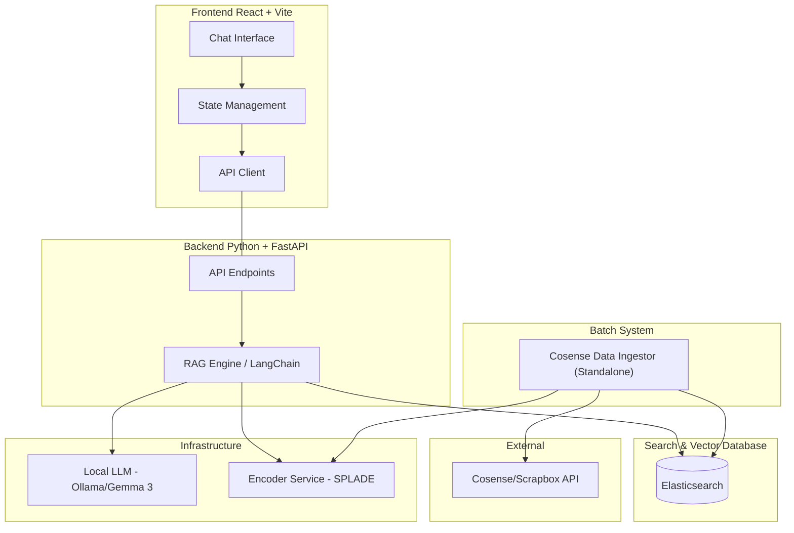

# System Architecture

This document describes the high-level architecture of the `rag-cosense` project.

## Overview

The system is a Retrieval-Augmented Generation (RAG) platform that integrates Cosense (Scrapbox) data with Large Language Models (LLMs).



## Component Details

### Frontend
- **React + Vite**: A modern single-page application (SPA).
- **Chat Interface**: The primary UI for user interaction.

### Backend
- **FastAPI**: Provides the REST API for the frontend.
- **LangChain**: Orchestrates the RAG workflow (Retrieval, Prompt Construction, LLM Interaction).

### Batch System
- **Standalone Batch Script**: Fetches pages from Cosense and processes them into chunks.
- **Manual Execution**: Run via `make sync`.

### Infrastructure / Tools
- **Elasticsearch**: A distributed search and analytics engine used for both full-text search and vector similarity search.
- **Ollama**: Local LLM runner providing the model (Gemma 3) for privacy-conscious inference.
- **Encoder Service**: A specialized service for sparse/dense vector generation (SPLADE).

### External Integrations
- **Cosense (Scrapbox)**: The source of truth for the knowledge base.

## Design Details (TBD)

### 1. Data Flow

#### Ingestion Flow (Manual Batch Sync) [IMPLEMENTED]
1. **Initiate**: User runs `make sync`.
2. **Fetch**: The batch script calls the Cosense API to retrieve page lists and metadata.
3. **Chunking**: Split via `RecursiveCharacterTextSplitter`.
4. **Sparse Embedding**: Call **Encoder Service** (`/encode`) to generate SPLADE sparse vectors.
5. **Persistence**: Upsert into **Elasticsearch** using `rank_features` for the sparse vector and `text` for content.

#### Query Flow (RAG Pipeline)
1. **Submit**: Frontend calls `POST /api/chat` with user query and context window (chat history).
2. **Embed Query**: Backend calls **Encoder Service** to convert the user's question into a sparse vector.
3. **Retrieval**: 
    - **Sparse Search**: Use Elasticsearch `rank_feature` query with the SPLADE vector to find relevant chunks.
    - **Keyword (Optional)**: Can be combined via Boolean query if needed.
4. **Context Building**: Extract Top-K (default=5) text chunks as context.
5. **Prompt Generation**: Construct a prompt containing Context + Chat History + Current Question.
6. **Inference**: Send prompt to **Ollama (Gemma 3)** for natural language generation.
7. **Complete**: Return the answer and source metadata to the frontend.

### 2. Backend API Specification

#### Common Response Format
Following `api-contract.instructions.md`, all responses wrap data or errors:
- **Success**: `{ "status": "success", "data": { ... } }`
- **Error**: `{ "status": "error", "message": string, "code": string }`
  - Codes: `AUTH_ERROR`, `SYNC_ALREADY_RUNNING`, `LLM_UNAVAILABLE`, `NOT_FOUND`.

#### Data Models (Pydantic/TypeScript)
- **`ChatMessage`**: `{ role: "user" | "assistant", content: string }`
- **`SourceReference`**: `{ title: string, url: string, score: number }`

#### Endpoints

##### 1. `POST /api/chat`
- **Purpose**: Interactive RAG chat.
- **Request Body**:
  ```json
  {
    "query": "string (min_length=1)",
    "chat_history": "Array<ChatMessage> (max_length=10)"
  }
  ```
- **Response Data**:
  ```json
  {
    "answer": "string",
    "sources": "Array<SourceReference>"
  }
  ```

##### 2. `GET /api/v1/health`
- **Purpose**: System health check.
- **Response Data**:
  ```json
  {
    "status": "ok",
    "services": {
      "elasticsearch": "connected",
      "ollama": "connected",
      "encoder": "connected"
    }
  }
  ```

#### Frontend Integration Notes
- **Error Handling**: Use the `code` field to trigger specific UI feedback (e.g., "Ollama is down" or "Authentication required").

### 3. Search & Retrieval Strategy
- **Indexing Strategy**:
    - **Field Mappings**:
        - `text`: `text` type (Full-text search enabled).
        - `sparse_vector`: `rank_features` type (SPLADE token-weight mapping).
        - `metadata`: `keyword` or `integer` types for `title`, `chunk_id`, and `project`.
    - **Chunking**: `RecursiveCharacterTextSplitter` with ~1000 chars and 100 char overlap.
- **Retrieval Logic (Sparse Search)**:
    - **SPLADE Search**: Use `rank_feature` query in Elasticsearch. This provides high-quality keyword-based semantic search by expanding queries with relevant tokens.
    - **Technology**: Custom `IndexerService` integration.

### 4. Local LLM Configuration
- **Model Runner**: [Ollama](https://ollama.com/)
    - Backend reaches Ollama via internal Docker network: `http://ollama:11434`.
- **Model Selection**: **Gemma 3 (4b recommended for speed, 12b for quality)**.
    - **Inference**: High-quality natural language generation and instruction following.
- **Encoder Service**:
    - **Model**: `hot-leaf-juice/splade-japanese-v3`.
    - **Role**: Specialized in Japanese sparse vector generation for search.
- **Initialization & Model Management**:
    - **Flow**:
        1. Start Ollama and Encoder containers.
        2. Automatic pull (Ollama): Backend check executes `ollama pull gemma3`.
        3. Encoder loads model on startup from Hugging Face.
    - **Verification**: Backend confirms status via health checks.
- **System Prompt Design**:
    - "You are a helpful assistant. Use ONLY the provided context snippets to answer. If you don't know, say you don't know."
    - Strict Markdown output for compatibility with the Chat UI.

### 5. Frontend Architecture
- **State**: Chat history management.
- **Components**: UI modularization.

### 6. Deployment & Environment

#### Docker Compose Service Structure
All services run within a single `compose.yml` file using a dedicated bridge network (`rag-network`).

- **Service Communication**:
    - Services resolve each other by name (e.g., the backend accesses `http://elasticsearch:9200`).
    - *Tip*: Use `extra_hosts: ["host.docker.internal:host-gateway"]` to allow container-to-host communication across different OS environments.
- **GPU Acceleration**:
    - **NVIDIA GPU (Linux/Windows)**: Uses `nvidia-container-toolkit`.
      ```yaml
      services:
        ollama:
          deploy:
            resources:
              reservations:
                devices:
                  - driver: nvidia
                    count: 1
                    capabilities: [gpu]
      ```
    - **Apple Silicon (macOS)**: Run Ollama as a native macOS application for Metal acceleration. Backend connects via `host.docker.internal:11434`.

#### Data Persistence
- **Elasticsearch**: Data indices are persisted in a named volume `es_data` (`/usr/share/elasticsearch/data`).
- **Ollama**: Downloaded models are persisted in `ollama_data` (`/root/.ollama`).

#### Environment Management
Configuration is centralized in a `.env` file.

**Template (`.env.example`):**
```bash
# Backend
BACKEND_PORT=8000

# Cosense
COSENSE_COOKIE=connect.sid=... # Required for private projects

# Infrastructure
ELASTICSEARCH_URL=http://elasticsearch:9200
ES_JAVA_OPTS="-Xms1g -Xmx1g" # Explicit heap size to prevent memory contention
OLLAMA_URL=http://ollama:11434
LLM_MODEL=gemma3:4b

# Frontend
VITE_API_BASE_URL=http://localhost:8000
```
